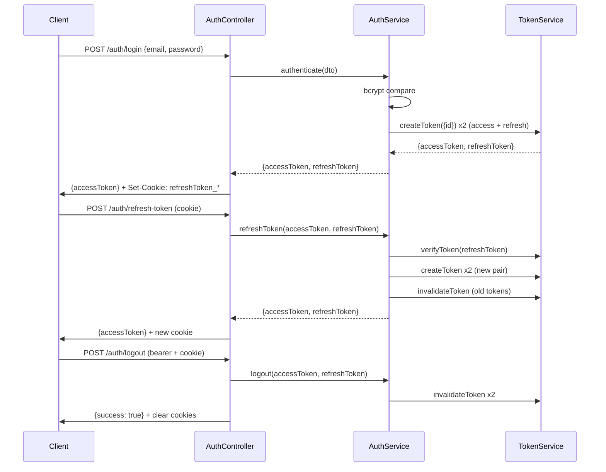
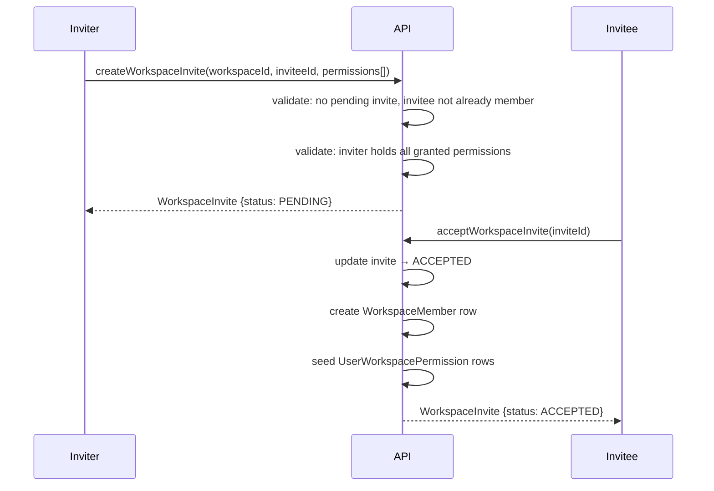

# Codebase Map

> Auto-generated by Cartographer. Last mapped: 2026-05-12T07:37:53Z

## System Overview

```mermaid
graph TB
    subgraph Client
        GQL[GraphQL Client]
        HTTP[HTTP Client]
    end

    subgraph NestJS App
        GQLMod[GraphQL / Apollo]
        AuthGuard[AuthGuard]
        AccessGuard[AccessGuard]
        TxInt[TransactionInterceptor]

        subgraph Domain
            User[User]
            Workspace[Workspace]
            WorkspaceMembership[Workspace Membership]
            WorkspaceHistory[Workspace History]
            WorkspaceStake[Workspace Stake]
            Item[Item]
            ItemStake[Item Stake]
            Payment[Payment]
            Tag[Tag]
            Contact[Contact]
            CurrencyRate[Currency Rate]
        end

        subgraph Infrastructure
            PrismaService[PrismaService]
            RedisService[RedisService]
            TokenService[TokenService x2]
            EventEmitter[EventEmitter2]
        end
    end

    subgraph External
        PostgreSQL[(PostgreSQL :9992)]
        Redis[(Redis :6380)]
        NBRB[NBRB Currency API]
        SMTP[SMTP Server]
    end

    GQL -->|POST /graphql| GQLMod
    HTTP -->|REST endpoints| NestJS App
    GQLMod --> AuthGuard --> AccessGuard --> TxInt --> Domain
    Domain --> PrismaService --> PostgreSQL
    Domain --> RedisService --> Redis
    TokenService --> RedisService
    CurrencyRate --> NBRB
    Contact --> SMTP
```

## Application Bootstrap

```
main.ts
  → NestFactory.create(AppModule)
  → configureApp(app)
      ├── cookie-parser middleware
      ├── ValidationPipe (custom exceptionFactory → ValidationError)
      ├── DbExceptionInterceptor (global)
      └── ApplicationExceptionFilter (global)
  → app.listen(:9998 dev / :8080 default)
```

## Directory Structure

```
src/
├── app.module.ts              # Root module — assembles all feature modules
├── app.config.ts              # Typed config factory (JWT secrets, DB, Redis, SMTP, port)
├── configure-app.ts           # Cross-cutting middleware, pipes, filters
├── main.ts                    # Entry point
├── migrate-data.entrypoint.ts # Alternate entry point for data migrations (CLI)
│
├── access/                    # RBAC/ABAC rule engine (@Access decorator + AccessGuard)
├── auth/                      # JWT login, refresh, logout, AuthGuard, cookie management
├── token/                     # Generic JWT service (sign, verify, invalidate via Redis)
├── user/                      # User CRUD, registration, UserRole enum
│
├── workspace/                 # Workspace CRUD; now carries stakeRule field
├── workspace-membership/      # Invite flow, member management, per-member permissions
├── workspace-history/         # Audit log: event listeners, history CRUD, diff/message
├── workspace-stake/           # Workspace-level stakeRule default and mutation to update it
│
├── item/                      # Expense category (title, workspaceId, stakeRule)
├── item-merge/                # Merge two items; payments reassigned, merging item deleted
├── item-extract/              # Split payments from an item into a new item
├── item-stake/                # Per-member expense stakes on an item (custom weights or rule)
├── item-tag/                  # Many-to-many Item ↔ Tag join
├── item-cost/                 # Cost aggregation: by-currency and default-currency conversion
├── items-aggregation/         # Items-level aggregation (count + nested payment metrics)
├── payment/                   # Individual expense record (cost, date, currency, payerId)
├── payments-aggregation/      # Payment metrics (count, sum, date range) per item set
├── tag/                       # Labels on items (title, color, workspace FK)
│
├── contact/                   # Social graph: invites, contacts, blocking, email invites
├── currency-rate/             # Exchange rates (BYN/USD/EUR) via NBRB API, cached in DB
├── confirm-email/             # Email verification (auto or manual strategy)
│
├── common/                    # Shared decorators, error hierarchy, interceptors, pipes
├── graphql/                   # Apollo setup, DataLoader base classes, custom scalars
├── prisma/                    # PrismaService (extends PrismaClient)
├── redis/                     # RedisService (extends ioredis Redis)
├── consistency/               # Cross-entity ownership assertion helpers
├── group/                     # Collection utility (mapBy, groupBy, sortBy)
├── date/                      # Date↔string utilities (YYYY-MM-DD ↔ Date at UTC midnight)
├── data-migration/            # One-shot spreadsheet import CLI
│
prisma/
└── schema.prisma              # Database schema (PostgreSQL, partialIndexes preview)

test/
├── *.e2e.spec.ts              # E2E integration tests (hit real test DB)
├── factory/                   # Test fixture factories per entity type
└── test-config.module.ts      # Loads .env.test; used by all E2E tests
```

---

## Module Guide

### Token Module (`src/token/`)

**Purpose:** Generic, reusable JWT issuance and Redis-backed invalidation. Registered twice — once for access tokens, once for refresh tokens — using different injection symbols, secrets, TTLs, and Redis prefixes.

**Entry point:** `TokenModule.register(symbol, configPath): DynamicModule`

**Key exports:**
- `TokenService<T>` — sign, verify, decode, invalidate JWTs. Tokens are salted (`salt: Math.random()`) so two calls with the same payload never produce the same token.
- `ACCESS_TOKEN_SERVICE` / `REFRESH_TOKEN_SERVICE` symbols (defined in `src/auth/symbols.ts`)

**Invalidation mechanism:** `invalidateToken(token)` hashes the raw JWT with SHA-256 and stores `<redisPrefix><hash>` → `""` in Redis with `EX = remaining TTL + 1s, NX`. `validateToken` checks `EXISTS` on the same key. Self-pruning: the Redis key expires when the JWT would have expired.

**Gotchas:**
- `decodeToken` performs no signature verification — only use when the token has already been verified or is about to be discarded.
- The `salt` field prevents hash collisions on same-payload tokens, which is important because invalidation is per-token, not per-user.

---

### Auth Module (`src/auth/`)

**Purpose:** Credential validation, JWT pair lifecycle, cookie management, and the `AuthGuard`.

**Key exports:** `AuthGuard`, `TokenModule` re-export (access token service).

**Full auth flow:**



**Cookie strategy:** The refresh token is set in **two path-scoped HttpOnly cookies** — one for `/auth/refresh-token`, one for `/auth/logout`. The browser only sends the cookie to those exact paths.

**AuthGuard behaviour:** Returns `true` (no error) if no token is present — this enables public GraphQL endpoints. Only resolvers decorated with `@Access` will enforce authentication via `AccessGuard`.

**Error codes (all HTTP 401):** `INVALID_CREDENTIALS`, `EMAIL_IS_NOT_VERIFIED`, `USER_BANNED`, `INVALID_REFRESH_TOKEN`, `UNKNOWN_USER`, `USER_NOT_AUTHORIZED`.

---

### Access Module (`src/access/`)

**Purpose:** Declarative, strategy-based fine-grained authorization layered on top of `AuthGuard`.

**Key exports:** `AccessGuard`, `AccessService`, `UserPermissionService`, `UserPermissionsByUserIdLoader`.

**How `@Access` works:**

```typescript
// On a resolver method:
@Access.allow({ self: 'user', permission: Permission.UPDATE_PROFILE })
@Access.allow({ role: [UserRole.ADMIN] })
// Evaluated as OR between all @Access calls on the same handler
// Within one call, and/or can be composed in the ruleDef object

@Infer('user', { from: fromArg('id'), pipes: [UserByIdPipe] })
// Infers the 'user' entity from resolver args, available to access rules
```

**Evaluation flow:** `AccessGuard` reads `@Access` metadata → checks `req.user` exists → resolves all `@Infer` entities (pipe chains) → evaluates the rule tree → throws `NoAccessError (HTTP 403)` on failure.

**Available strategies:**

| Strategy | Triggered when | Checks |
|---|---|---|
| `UserRoleAccessStrategy` | `scope=USER`, no `permissions`, no `self` | `user.role` in rule roles; optionally `user.id === target.id` |
| `UserSelfAccessStrategy` | `scope=USER`, `self=true` | `currentUser.id === targetEntity.id` |
| `UserPermissionAccessStrategy` | `scope=USER`, `permissions[]` defined | All listed `UserPermission` rows exist for this user |
| `UserToWorkspaceAccessStrategy` | `scope=WORKSPACE`, `workspaceRole[]` defined | User is owner or active member with matching role |
| `WorkspaceOwnerAccessStrategy` | `scope=WORKSPACE`, `ownerCheck=true` | `workspace.ownerId === currentUser.id` (no DB query) |
| `WorkspacePermissionAccessStrategy` | `scope=WORKSPACE`, `workspacePermissions[]` defined | All listed `UserWorkspacePermission` rows exist |

**`fromArg(path)` / `fromReq(path)`:** Helper factories for `@Infer`'s `from` option — resolve values from GraphQL args or the HTTP request via dot-path.

---

### User Module (`src/user/`)

**Purpose:** User CRUD, role management, and GraphQL resolvers.

**Key exports:** `UserService`.

**UserRole enum:** `USER` (default), `ADMIN`. Flat hierarchy.

**Registration flow:**
1. `PublicUserMutationResolver.createUser` (no guards) → `UserService.create(dto, tx)`
2. Hash password (bcrypt), create user, seed 10 default `UserPermission` rows.
3. Call `ConfirmEmailService.runConfirmationProcess` → user cannot log in until email verified.

**Default user permissions (seeded on registration):** `CREATE_WORKSPACE`, `UPDATE_PROFILE`, `CREATE_CONTACT_INVITE`, `ACCEPT_CONTACT_INVITE`, `REJECT_CONTACT_INVITE`, `BLOCK_USER`, `UNBLOCK_USER`, `DELETE_CONTACT`, `ACCEPT_WORKSPACE_INVITE`, `REJECT_WORKSPACE_INVITE`.

**Key resolvers:**
- `me` — any authenticated user (no `@Access` rule, just `AuthGuard`)
- `user(id)` — self or ADMIN
- `users` — ADMIN only
- `updateUser` — self + `UPDATE_PROFILE` permission OR ADMIN
- `deleteUser`, `banUser`, `unbanUser` — ADMIN only

**`isEmailVerified`:** Computed field — `confirmEmailTempCode === null` means verified.

---

### Workspace Module (`src/workspace/`)

**Purpose:** Workspace CRUD. A workspace is the top-level container for items, tags, payments, and members. Scoped to one owner.

**Workspace entity fields:** `id`, `title`, `defaultCurrency: Currency`, `ownerId`, `stakeRule: StakeRule`.

**`stakeRule`:** The default stake distribution rule applied to new items created in this workspace. Always non-null (defaults to `ALL_PAYER`). Changing it does not retroactively affect existing items.

**GraphQL mutations:**

| Mutation | Access |
|---|---|
| `createWorkspace` | `CREATE_WORKSPACE` permission OR ADMIN |
| `updateWorkspace` | Workspace owner OR ADMIN |
| `deleteWorkspace` | Workspace owner OR ADMIN |

**Resolved fields on Workspace:** `items`, `tags`, `itemsAggregation`, `history`, `members`, `pendingInvites`.

**Gotcha:** `deleteWorkspace` hard-deletes from the DB. The history event is emitted *before* deletion so the listener writes the audit row inside the same transaction before the workspace row disappears.

---

### Workspace-Stake Module (`src/workspace-stake/`)

**Purpose:** Manages the workspace-level default `stakeRule` — the rule applied to items on creation when no item-level override is set.

**Mutation:** `updateWorkspaceStakeRule(workspaceId: Int!, stakeRule: StakeRule!): Workspace!`

**Access rules (OR):** `WorkspacePermission.UPDATE_WORKSPACE_STAKE_RULE` OR workspace owner OR ADMIN.

**What it does:** Updates `workspace.stakeRule` only. Does **not** retroactively change any existing items. Emits `WorkspaceHistoryEvent.WORKSPACE_UPDATED`.

**`StakeRule` enum:**

| Value | Meaning |
|---|---|
| `ALL_PAYER` | Full cost attributed to whoever made the payment (workspace default) |
| `ALL_WORKSPACE_OWNER` | Full cost always attributed to the workspace owner |
| `EQUALLY` | Cost split equally among all workspace members |

---

### Workspace-Membership Module (`src/workspace-membership/`)

**Purpose:** Full lifecycle of workspace membership — invites, member management, and per-member permission grants.

**WorkspaceInviteStatus:** `PENDING` → `ACCEPTED` | `REJECTED` | `CANCELLED`

**Invite flow:**



**WorkspacePermission values (19):** `CREATE/UPDATE/DELETE_ITEM`, `CREATE/UPDATE/DELETE_PAYMENT`, `CREATE/UPDATE/DELETE_TAG`, `ASSIGN/UNASSIGN_TAG`, `MERGE_ITEMS`, `EXTRACT_ITEM`, `CREATE/CANCEL_WORKSPACE_INVITE`, `GRANT/REVOKE_WORKSPACE_PERMISSION`, `REMOVE_WORKSPACE_MEMBER`, `OVERRIDE_ITEM_STAKES`, `UPDATE_WORKSPACE_STAKE_RULE`.

**Permission grant/revoke guard:** Two-layer — `@Access` decorator for coarse entry control; `WorkspaceMemberPermissionService.validateActorCanModify` at runtime prevents granting permissions the actor doesn't hold (anti-escalation). This runtime check is intentionally separate from `@Access` because it is input-dependent.

**Member soft-delete:** `WorkspaceMember.removedAt` is the sentinel. Active members have `removedAt: null`. Removal also hard-deletes all `UserWorkspacePermission` rows for that user+workspace (via `WorkspaceMemberPermissionService.revokeAllPermissions()`, run inside the same transaction).

**Cannot remove workspace owner:** `leaveWorkspace` and `removeWorkspaceMember` both enforce this.

**Error — `WorkspaceMemberNotBelongingToWorkspaceError`:** HTTP 404 (not 400). Thrown when a provided `workspaceMemberId` does not belong to the expected workspace. Used in payment creation/update and stake validation.

---

### Workspace-History Module (`src/workspace-history/`)

**Purpose:** Immutable audit log for all workspace mutations via an event-driven architecture.

**23 tracked actions:** Items (created/updated/deleted/merged/extracted), Payments (CUD), Tags (CUD + tag assigned/unassigned), Workspace (created/updated/deleted), Workspace invites (created/accepted/rejected/cancelled), Workspace members (created/removed), **Item stakes changed**.

**Event flow:**
1. Service method emits `eventEmitter.emitAsync(WorkspaceHistoryEvent.*, { actorId, entity, tx })`
2. `WorkspaceHistoryEventListenerService` (`@OnEvent`) receives and calls `WorkspaceHistoryService.create*()`
3. History row written using the **same Prisma transaction** as the triggering mutation — atomic commit

**History record:** `{ workspaceId, actorId, action, oldValue: JSON, newValue: JSON }` — full entity snapshots stored verbatim.

**Computed fields:**
- `actor: User` — resolved via `UserByUserIdLoader`
- `message: String` — human-readable sentence (built from JSON blobs)
- `changes: JSON` — field-level diff of whitelisted fields

**`ITEM_STAKES_CHANGED` specifics:**
- Event DTO: `OnItemStakesChangedEvent` — carries `{ stakeRule, stakes: ItemStake[], itemId }` in both `oldValue` and `newValue`.
- Stored stakes format: compact object `{ [workspaceMemberId]: value }` (sorted by member id), serialized to JSON string. Empty stakes stored as `null`, not `[]`.
- Message format: `"<actorName> changed stakes for item #<itemId>"`.
- `ChangesService.getItemStakesDiff` diffs `stakeRule` and `stakes` strings between old and new.

**Known gaps:** `WorkspaceHistoryMessageService` and `ChangesService` both lack cases for membership actions (`WORKSPACE_INVITE_*`, `WORKSPACE_MEMBER_*`). Requesting `.message` or `.changes` on those entries returns `undefined` / throws.

---

### Item Module (`src/item/`)

**Purpose:** Core domain entity — a named expense category within a workspace.

**Item entity fields:** `id`, `title`, `workspaceId`, `stakeRule: StakeRule | null`, `createdAt`, `updatedAt`. Relations: `payments`, `tags`, `workspace`, `itemStakes`.

**`stakeRule`:** Set to `workspace.stakeRule` at creation time. Set to `null` when custom per-member `ItemStake` rows are active. Mutually exclusive with `ItemStake` records — a non-null rule means no custom stakes exist; `null` means custom stakes are in effect.

**GraphQL:**
- Queries: `item(id)`, `items(workspaceId, itemsFilter?, paymentsFilter?)`
- Mutations: `createItem`, `updateItem`, `deleteItem`
- `ItemsFilter`: `tagIds?: [Int]` (match any), `title?: String` (case-insensitive contains), `ids?: [Int]` (exact id list)

**DataLoader:** `ItemsByWorkspaceIdLoader` (request-scoped, nested with `{itemsFilter, paymentsFilter}` as option key). `ItemByPaymentIdLoader` (batches item lookups for the `Payment.item` field).

**`ItemNotFoundError`:** HTTP 400 (not 404).

---

### Item-Stake Module (`src/item-stake/`)

**Purpose:** Manages per-member expense stake allocations on an item. Stakes represent how payment costs are distributed across workspace members for a given item. Two modes: rule-based (one of three `StakeRule` values) or custom per-member weights (`ItemStake` rows).

**Mutations:**

| Mutation | Description | Access |
|---|---|---|
| `setItemStakes(itemId, stakes: [MemberStake!]!)` | Full replacement of custom per-member stake weights | Owner OR `OVERRIDE_ITEM_STAKES` OR ADMIN |
| `setItemStakeRule(itemId, stakeRule: StakeRule!)` | Switch item to a rule-based distribution | Owner OR `OVERRIDE_ITEM_STAKES` OR ADMIN |

**`MemberStake` input:** `{ workspaceMemberId: Int!, value: Float! }`

**`setItemStakes` validation (sequential; first failure throws):**

| Order | Check | Error |
|---|---|---|
| 1 | Duplicate `workspaceMemberId` in input | `WorkspaceMemberStakeDuplicatedError` (400) |
| 2 | Any active workspace member missing from input | `WorkspaceMemberStakeNotSpecifiedError` (400) |
| 3 | Any submitted member not in active member list | `WorkspaceMemberNotBelongingToWorkspaceError` (404) |
| 4 | Any `value < 0` | `WorkspaceMemberStakeHasNegativeValueError` (400) |
| 5 | Sum of all values `≤ 0` | `NonPositiveSumOfStakeValuesError` (400) |

**Critical invariant:** `setItemStakes` is a **full replacement** — the input must contain exactly the set of all currently active workspace members. Partial updates are not supported.

**`setItemStakeRule` behaviour:** Idempotent if the item already has that rule. Deletes all `ItemStake` rows for the item when switching to rule-based mode. Emits `ITEM_STAKES_CHANGED`.

**Mode transitions:**
- `setItemStakes` → sets `item.stakeRule = null`, upserts stake rows
- `setItemStakeRule` → sets `item.stakeRule = value`, deletes stake rows
- These two modes are mutually exclusive; transitions always clean up the other side.

**DataLoader:** `ItemStakesByItemIdLoader` (request-scoped) — batches all `item.itemStakes` field resolutions into a single `findMany` grouped by `itemId`.

**Gotchas:**
- `item.stakeRule` is never `null` on creation — it copies the workspace default. `null` is a runtime state meaning custom stakes are active.
- Workspace stakeRule changes are not retroactive — existing items keep their current rule/stakes.
- When a workspace member is removed (soft-delete), their `ItemStake` rows remain in the DB. Any subsequent `setItemStakes` call must exclude the removed member; including them throws `WorkspaceMemberNotBelongingToWorkspaceError`.
- `ItemStake.workspaceMember` relation has no dedicated field resolver — `workspaceMember` must be fetched via include, not a DataLoader.
- There is a stale duplicate DTO file at `src/item-stake/entity/member-stake.in.dto.ts` (not exported by `entity/index.ts`). The canonical DTO is `src/item-stake/dto/member-stake.in.dto.ts`.

---

### Item-Merge Module (`src/item-merge/`)

**Purpose:** Merge two items. Host item survives; merging item is destroyed.

**Mutation:** `mergeItems(hostItemId, mergingItemId): Item`

**What happens (single transaction):**
1. Payments without a title in the merging item inherit `mergingItem.title` (provenance preservation).
2. All payments of `mergingItem` are reassigned to `hostItem`.
3. All `ItemTag` join records for `mergingItem` are deleted (tags NOT copied).
4. `mergingItem` is hard-deleted.
5. `ITEM_MERGED` history event emitted.

**Constraint:** Both items must belong to the same workspace (`ConsistencyService.itemsToSameWorkspace`).

---

### Item-Extract Module (`src/item-extract/`)

**Purpose:** Split a subset of payments from an item into a brand-new item. Inverse of merge.

**Mutation:** `extractAsItem(itemId, paymentIds[], title): Item` — returns the new item.

**Validation errors (HTTP 400):**
- `ExtractPaymentsEmptyError` — empty `paymentIds`
- `PaymentNotBelongToItemError` — any payment doesn't belong to source item
- `ExtractAllPaymentsError` — would remove all payments (source must retain ≥ 1)

**What happens:** New item created → payments moved → **all tags copied** to new item (both source and extracted item end up sharing the same tags).

---

### Item-Tag Module (`src/item-tag/`)

**Purpose:** Manages the `ItemTag` many-to-many join between items and tags.

**Mutations:** `assignTag(itemId, tagId): ItemTag`, `unassignTag(itemId, tagId): Boolean`

**Constraints:** Item and tag must belong to the same workspace. Duplicate assign or unknown unassign throws `BadRequestException`.

**DataLoaders:** `TagsByItemIdLoader` (for `Item.tags`), `ItemsByTagIdLoader` (for `Tag.items`, nested with filters).

---

### Item-Cost Module (`src/item-cost/`)

**Purpose:** Two cost-calculation strategies: aggregate by currency (no conversion), and convert all payments to the workspace's default currency using date-specific exchange rates.

**`CostByCurrencyService.getCostByCurrency(payments)`:** Groups payments by `Currency` enum value, sums each group with Prisma `Decimal`. Always initialises all three currencies (`BYN`, `USD`, `EUR`) to `Decimal(0)`.

**`DefaultCurrencyCostService.getCostInDefaultCurrency(...)`:** Applies rate of `1` for same-currency payments; looks up the rate by exact `(fromCurrency, toCurrency, date)` match. Throws `InternalServerErrorException` if a rate is missing.

**`PaymentLike` type:** `Pick<Payment, 'id' | 'cost' | 'currency' | 'date'>` — intentionally does not include `payerId`. Cost calculation does not need to know who paid.

**Gotcha:** Conversion uses the payment's exact date, not today's rate. Missing rate → 500 (not 400).

---

### Payment Module (`src/payment/`)

**Purpose:** Individual expense record within an item.

**Payment entity fields:** `id`, `title?: String`, `cost: Decimal`, `currency: Currency`, `date: Date` (YYYY-MM-DD), `itemId`, `payerId: Int`, `createdAt?: DateIso`, `updatedAt?: DateIso`.

**`payerId`:** Required FK to `WorkspaceMember`. Identifies who made the payment. Resolved to `payer?: WorkspaceMember` via a field resolver. The mutation resolver resolves the member object from `dto.payerId` via `WorkspaceMemberByIdPipe`, validates membership belongs to the same workspace, then passes the object to the service (stripping `payerId` from the DTO).

**GraphQL:**
- Queries: `payment(id)`, `payments(itemId, paymentsFilter?)`
- Mutations: `createPayment`, `updatePayment`, `deletePayment`
- `PaymentsFilter`: `dateFrom?: Date`, `dateTo?: Date`, `ids?: [Int]`

**`ids` filter behaviour:** Pushed into SQL `WHERE id IN (...)` in `getPaymentsByItemIds` and `getItemPayments`. Applied in-memory via `filterPayments()` in the dataloader code path.

**Gotcha — date boundary mismatch:** DB query uses `lte dateTo` (inclusive); in-memory `filterPayments()` uses `< dateTo` (exclusive). Code paths using both may disagree on boundary payments.

**Gotcha — `filterPayments` is in-memory in the dataloader path.** The `ItemPaymentsFieldResolver` batch-loads all payments then filters in-memory; the `ids` filter in that path does not go to SQL.

---

### Tag Module (`src/tag/`)

**Purpose:** Labels that can be assigned to items within a workspace.

**Tag entity fields:** `id`, `title`, `color` (6-char hex without `#`, default `"000000"`), `workspaceId`.

**GraphQL:**
- Queries: `tags(workspaceId, tagsFilter?)`, `tag(id)`
- Mutations: `createTag`, `updateTag`, `deleteTag`

**Access pattern:** owner OR relevant workspace permission (e.g., `CREATE_TAG`) OR ADMIN.

---

### Payments-Aggregation Module (`src/payments-aggregation/`)

**Purpose:** Deferred computation of payment metrics (count, sum in default currency, sum by currency, date range) across a set of item IDs.

**How it works:** Parent resolvers (e.g., `Item.paymentsAggregation`) return a shell object `{ itemIds, paymentsFilter }`. `PaymentsAggregationResolver` resolves individual fields using dedicated batched DataLoaders per metric type. Each loader uses `NestedLoader` with `PaymentsFilter` as the option key.

**Computed fields:** `count`, `costInDefaultCurrency`, `costByCurrency`, `firstPaymentDate`, `lastPaymentDate`.

---

### Items-Aggregation Module (`src/items-aggregation/`)

**Purpose:** One level above payments aggregation — aggregates item counts with nested payment metrics.

**Exposed as:** `Workspace.itemsAggregation`, `Tag.itemsAggregation`, and a global `itemsAggregation` query.

**`ItemsAggregation` fields:** `count: Int`, `paymentsAggregation: PaymentsAggregation`.

---

### Contact Module (`src/contact/`)

**Purpose:** Manages the social graph — bidirectional contact relationships, invite lifecycle, user blocking, and email-based out-of-band invites.

**Invite lifecycle (regular):**

```
createInvite (inviter → invitee)
  acceptInvite   → creates bidirectional Contact pair (2 rows)
  rejectInvite   → no contact created
  rejectInviteAndBlockUser → reject + block inviter
deleteContact    → soft-deletes both Contact rows (removedAt set)
```

**Blocking:**
- `blockUser` creates a `UserBlock` row AND removes the active contact pair.
- `unblockUser` soft-deletes the block.
- Active block prevents: creating invites, accepting invites, rejecting invites in the affected direction.

**Email invite flow (for users without accounts):**
1. `createInviteByEmail(inviterUserId, inviteeEmail)` — creates a ghost user with a synthetic hashed email, creates an invite record, emails a JWT link.
2. `GET /email-invite/accept?token=…` — if a real account exists with that email, the ghost is replaced; otherwise the ghost is promoted. Creates the contact pair.
3. `GET /email-invite/reject?token=…` — ghost user is deleted.

**Gotcha — ghost users:** If an email invite is never acted on, the ghost user persists indefinitely. No TTL or cleanup job exists.

**Gotcha — `listByUserIds` on `UserBlockService`** does not filter `removedAt: null`, so the blocked users list may include previously-unblocked users.

---

### Currency-Rate Module (`src/currency-rate/`)

**Purpose:** Provides historical exchange rates (BYN/USD/EUR), sourced from the National Bank of Belarus (NBRB) API. Rates are cached in the DB permanently once fetched.

**Rate computation:** NBRB API provides `X foreign units = Y BYN`. Cross-rates (e.g., USD → EUR) are derived as `rateUSD_BYN / rateEUR_BYN`. Same-currency rate is always `1`.

**`CurrencyRateService.findOrPull`:** DB lookup first; on miss, calls `https://api.nbrb.by/exrates/rates/{currency}?ondate={date}&parammode=2&periodicity=0`, saves result to DB. Only stores `X → BYN` pairs; cross-rates are computed in-memory.

**Gotcha:** `toCurrency` must be `BYN` when calling `findOrPull` directly; cross-rate computation is only in `get`/`getMany`. API errors are caught and logged, returning `undefined` (no throw).

---

### Confirm-Email Module (`src/confirm-email/`)

**Purpose:** Email verification after registration, with two strategies selected at runtime via config.

**Strategies:**
- `auto` — immediately clears `confirmEmailTempCode = null`. For dev/test.
- `manual` — generates a UUID as `confirmEmailTempCode`, stores it, emails a JWT link. `GET /confirm-email?token=…` verifies the JWT, compares the UUID, then clears the field.

**One-time use:** After verification, `confirmEmailTempCode` is `null`. Replaying the token fails the code comparison.

**Config key:** `confirmEmail.strategy` — `'auto'` or `'manual'`.

---

### Consistency Module (`src/consistency/`)

**Purpose:** Reusable ownership assertion helpers for the service layer.

**`ConsistencyService` relations:**

| Relation | Rule |
|---|---|
| `paymentToItem` | `payment.itemId === item.id` |
| `workspaceToUser` | `workspace.ownerId === user.id` |
| `itemToWorkspace` | `item.workspaceId === workspace.id` |
| `tagToWorkspace` | `tag.workspaceId === workspace.id` |
| `itemAndTagToSameWorkspace` | `item.workspaceId === tag.workspaceId` |
| `itemsToSameWorkspace` | `item1.workspaceId === item2.workspaceId` |

**Gotcha:** `AsyncRelation.ensureIsBelonging` has a bug — missing `await` means it never throws. The async variant is effectively broken.

---

### Common Infrastructure (`src/common/`)

**Error hierarchy:**

```
Error
  └── ApplicationError                         # base; sets this.name, captures stack
        └── CodedApplicationError              # + code: ApplicationErrorCode enum
              └── DetailedApplicationError<T>  # + details: T (abstract)
                    └── ValidationError        # details: ClassValidatorError[], HTTP 400
```

All domain errors extend `CodedApplicationError` and use `@HttpErrorCode(HttpStatus.*)` decorator. `ApplicationExceptionFilter` catches them and formats GraphQL errors as `{ code, details, error, message, status }`.

**`ApplicationErrorCode` stake-domain values:** `WORKSPACE_MEMBER_STAKE_NOT_SPECIFIED`, `WORKSPACE_MEMBER_STAKE_HAS_NEGATIVE_VALUE`, `WORKSPACE_MEMBER_STAKE_DUPLICATED`, `NON_POSITIVE_SUM_OF_STAKE_VALUES`.

**Key decorators:**
- `@Infer(key, { from, pipes[] })` — stores metadata for entity inference in access guards. `from` is a function against GQL context or a string key referencing another inferred entity. `pipes` transforms the raw value.
- `@HttpErrorCode(status)` — attaches HTTP status to error classes; walked up the prototype chain to support inheritance.
- `@Memo()` — unbounded, permanent memoization via module-level Map. No TTL or eviction.

**Utility functions (`src/common/function/`):**
- `unique` — array filter predicate: keeps only the first occurrence of each element. Use as `.filter(unique)` to deduplicate primitives.
- `duplicates` — array filter predicate: keeps only repeated elements (second occurrence onward). Works via `indexOf` strict equality; not suitable for object deduplication.

**Entity-resolution pipes (`src/common/pipe/`):** All follow the same pattern — receive an ID or entity, query Prisma, throw on miss, return entity. Used extensively in `@Infer` chains to resolve access-guard dependencies.

**Interceptors:**
- `TransactionInterceptor` — wraps GraphQL mutations in `prisma.$transaction`; exposes client as `context.tx`.
- `HttpTransactionInterceptor` — same for HTTP handlers; exposes as `req.tx`.

**GraphQL scalars:**

| Name | Serialize | ParseValue | Gotcha |
|---|---|---|---|
| `Date` | `"YYYY-MM-DD"` string | `Date` at UTC midnight | `parseLiteral` not anchored to midnight |
| `DateIso` | Full ISO string | `new Date(value)` | No null handling in serialize |
| `Decimal` | String (preserves precision) | `new Decimal(value)` | Falsy values (incl. `0`) serialize as `null` |
| `Json` | Pass-through | Pass-through | Thin wrapper over `graphql-type-json` |

---

### Data-Migration Module (`src/data-migration/`)

**Purpose:** One-shot spreadsheet-to-DB import CLI tool. Reads data from a Google Sheets spreadsheet, prompts for credentials and default currency, then creates users, workspaces, items, tags, payments, and workspace members in sequence.

**Entry point:** `src/migrate-data.entrypoint.ts` (alternate bootstrap, not the standard HTTP server). Registered in `AppModule` but only active when invoked via the CLI entry point.

**Dependencies:** `SpreadsheetService`, `TagService`, `ItemService`, `ItemTagService`, `PaymentService`, `UserService`, `WorkspaceService`, `WorkspaceMemberService`, `InquirerService` (CLI prompts).

---

### Prisma Module (`src/prisma/`)

**Purpose:** Shared `PrismaService` — the single DB connection for the entire app.

**`PrismaService`** extends `PrismaClient`, uses `@prisma/adapter-pg` (driver adapter pattern). Connects on module init, disconnects on destroy. Optional query logging when `db.logQuery=true`.

**Transaction pattern:** All service methods accept `tx: Prisma.TransactionClient = this.prisma`. Services use `tx` when a transaction is active; fall back to top-level client otherwise.

---

### Redis Module (`src/redis/`)

**Purpose:** `RedisService` extending `ioredis`'s `Redis`. Used for JWT blocklisting by `TokenService`.

**Extends `ioredis.Redis` directly** — all standard Redis commands available without wrapping. Optional command logging when `redis.logQuery=true`. Disconnects on module destroy.

---

### Group Module (`src/group/`)

**Purpose:** Collection utility — not a domain concept.

| Method | Behaviour |
|---|---|
| `mapBy(items, key)` | Key → first item (1:1 Map) |
| `groupBy(items, key)` | Key → item array (1:many Map) |
| `sortBy(items, key, orderedKeys)` | Reorders results to match DataLoader input order |

`sortBy` is used in all DataLoaders to return results in the same order as batched input IDs.

---

### Date Module (`src/date/`)

**Purpose:** `DateService.toString(date)` → `"YYYY-MM-DD"` (UTC); `DateService.fromString(str)` → `new Date('${str}T00:00:00Z')`. Used by currency-rate module for date serialization.

---

## Data Model Reference

### Database Enums

| Enum | Values |
|---|---|
| `Currency` | `BYN`, `USD`, `EUR` |
| `UserRole` | `USER`, `ADMIN` |
| `Permission` (user-level) | 10 values (see User module) |
| `WorkspacePermission` (workspace-level) | 19 values (see Workspace-Membership module) |
| `InviteStatus` (contact) | `PENDING`, `ACCEPTED`, `REJECTED` |
| `WorkspaceInviteStatus` | `PENDING`, `ACCEPTED`, `REJECTED`, `CANCELLED` |
| `WorkspaceHistoryAction` | 23 values |
| `StakeRule` | `ALL_PAYER`, `ALL_WORKSPACE_OWNER`, `EQUALLY` |

### Soft-Delete Pattern

`Contact`, `UserBlock`, and `WorkspaceMember` use `removedAt: DateTime?` (null = active). Uniqueness of active records is enforced via partial indexes (`WHERE removedAt IS NULL`) — requires Prisma `partialIndexes` preview feature.

### Schema Highlights

- `Workspace.stakeRule: StakeRule` — default distribution rule for new items; non-null, defaults to `ALL_PAYER`.
- `Item.stakeRule: StakeRule?` — nullable; `null` means custom `ItemStake` rows are active.
- `ItemStake` — `(itemId, workspaceMemberId, value: Float)` unique on `(itemId, workspaceMemberId)`. Cascade-deleted with the item.
- `Payment.payerId: Int` — required FK to `WorkspaceMember`; identifies who made the payment.
- `WorkspaceInvite.permissions: WorkspacePermission[]` — permissions to grant are stored on the invite itself, applied on accept.
- `Tag.color` — stored without `#` prefix, always 6 chars, defaults to `"000000"`.
- `Payment.title` is optional; `Item.title` is required.
- `User.confirmEmailTempCode !== null` means email not yet verified.

---

## Key Data Flows

### GraphQL Request Pipeline

```
POST /graphql
  → AuthGuard (validates bearer token, sets req.user)
  → AccessGuard (evaluates @Access rules via strategies)
  → TransactionInterceptor (wraps mutation in prisma.$transaction)
  → Resolver method
      → @Infer pipes already resolved by AccessGuard
      → Service method(dto, context.tx)
          → EventEmitter.emitAsync → WorkspaceHistoryEventListener → history row (same tx)
      → DataLoaders for field resolution (batched, request-scoped)
  → formatError (strip Apollo envelope → {code, details, error, message, status})
```

### Auth Token Lifecycle

```
Login                    → createToken() with random salt → JWT signed
                         → invalidateToken() not called
Request                  → verifyToken() → jwtVerify() + Redis EXISTS check
Logout/Refresh           → invalidateToken() → SHA-256(token) → Redis SET EX NX
Token expires            → Redis key auto-expires (TTL = JWT remaining life)
```

### Stake Resolution for an Item

```
Item.stakeRule is non-null?
  YES → use StakeRule enum value (ALL_PAYER / ALL_WORKSPACE_OWNER / EQUALLY)
  NO  → item has custom ItemStake rows; use per-member weight values

setItemStakeRule(item, rule) → set item.stakeRule = rule, delete all ItemStake rows
setItemStakes(item, stakes)  → validate completeness, upsert ItemStake rows, set item.stakeRule = null
updateWorkspaceStakeRule(ws, rule) → updates workspace default only; no effect on existing items
```

---

## Conventions

### Naming

| Pattern | Example |
|---|---|
| `*.module.ts` | `workspace.module.ts` |
| `*.service.ts` | `workspace.service.ts` |
| `*.resolver.ts` | `workspace.mutation.resolver.ts` |
| `*.entity.ts` | `workspace.entity.ts` (GraphQL `@ObjectType`) |
| `*.in.dto.ts` | `workspace.in.dto.ts` (GraphQL `@InputType`) |
| `*.loader.ts` | `workspaces-by-user-id.loader.ts` |
| `*.pipe.ts` | `workspace-by-id.pipe.ts` |
| `*.error.ts` | `workspace-not-found.error.ts` |

### Vertical spacing (from CLAUDE.md)

Control flow blocks (`if`, `switch`, `for`) need an empty line before and after, except at block start/end. `return` and `break` need an empty line before when not the only statement. Blocks never start or end with a blank line.

### Module pattern

Each NestJS module exports only what other modules need. Domain services are the usual export. Guards (AuthGuard, AccessGuard), DataLoaders (via dedicated loader modules like `UserLoaderModule`), and scalars are re-exported where cross-module use is needed.

### Transaction convention

All service methods: `methodName(args, tx: Prisma.TransactionClient = this.prisma)`. The interceptor injects `context.tx` (GQL) or `req.tx` (HTTP). Services are therefore usable both inside and outside transactions without overloading.

---

## Gotchas

- **`AuthGuard` returns `true` when no token is present.** Public resolvers work because there is no `@Access` rule — `AccessGuard` is a no-op. This is intentional but non-obvious.
- **`DecimalScalar.serialize` returns `null` for falsy values including `0`.** A payment cost of `0` would be serialized as `null` in GraphQL responses.
- **`WorkspaceHistoryMessageService` and `ChangesService` are incomplete** for membership events (`WORKSPACE_INVITE_*`, `WORKSPACE_MEMBER_*`). Requesting `.message` or `.changes` on those history entries will return `undefined` or throw.
- **Ghost users from email invites persist forever.** No TTL or cleanup runs.
- **`AsyncRelation.ensureIsBelonging` never throws** (missing `await`). Only the synchronous `Relation` variant is reliable.
- **Payment date filter boundary mismatch:** DB query uses `dateTo` inclusive; in-memory filter uses `dateTo` exclusive. Boundary payments may be included/excluded inconsistently depending on code path.
- **`@Memo()` cache is permanent and unbounded.** Suitable only for immutable, low-cardinality data.
- **Spreadsheet and external service config is partially hardcoded** in `app.config.ts` (spreadsheet ID, column names). Not overridable via env vars.
- **GraphiQL is always enabled** regardless of environment — no `NODE_ENV` gate.
- **`setItemStakes` is a full replacement, never a partial update.** Every call must include all active workspace members or validation fails.
- **Item `stakeRule` is never `null` at creation** — it copies the workspace default. `null` only arises after `setItemStakes` is called. `null` and `ItemStake` rows are mutually exclusive modes.
- **Workspace `stakeRule` change is not retroactive.** Existing items keep their current rule; only future items inherit the new workspace default.
- **Removed workspace members leave `ItemStake` orphans.** Soft-deleting a member does not cascade to their `ItemStake` rows. Those rows persist until the item's stakes are explicitly reset via `setItemStakes` or `setItemStakeRule`.
- **`WorkspaceMemberNotBelongingToWorkspaceError` is HTTP 404**, not 400. Used for cross-workspace membership violations in both payments and stake validation.
- **Stale duplicate DTO at `src/item-stake/entity/member-stake.in.dto.ts`** — not exported by `entity/index.ts`. The canonical one is `src/item-stake/dto/member-stake.in.dto.ts`.

---

## Navigation Guide

**To add a new GraphQL mutation:**
1. Define DTO in `src/<domain>/dto/<name>.in.dto.ts`
2. Add method to `src/<domain>/<domain>.service.ts`
3. Add resolver method in `src/<domain>/resolver/<domain>.mutation.resolver.ts`
4. Add `@Access.allow(...)` and `@Infer(...)` decorators
5. Emit a history event via `eventEmitter.emitAsync` if the domain tracks history
6. Add a listener handler in `workspace-history/workspace-history-event-listener.service.ts`

**To add a new access strategy:**
1. Create `src/access/strategy/<name>.access-strategy.ts` implementing `AccessStrategy`
2. Register in `AccessModule` providers array under `ACCESS_STRATEGIES` token

**To add a new entity-resolution pipe:**
1. Create `src/common/pipe/<entity>-by-<source>.pipe.ts` implementing `PipeTransform`
2. Inject `PrismaService`, query, throw domain error on miss

**To add a new DataLoader:**
1. Extend `BaseLoader` (simple) or `NestedLoader` (with filter options)
2. Implement `loaderFn(keys)` or `loaderWithOptionsFn(keys, options)`
3. Use `GroupService.sortBy` to align results with input key order
4. Register with `Scope.REQUEST` in the module providers

**To add a new workspace permission:**
1. Add to `WorkspacePermission` enum in Prisma schema
2. Run `prisma:migration:create` + `prisma:migration:up`
3. Run `prisma:client:generate`
4. Add `@Access.allow({ workspacePermissions: [WorkspacePermission.NEW_VALUE] })` on resolver

**To work with item stakes:**
- Custom per-member weights → `setItemStakes(itemId, stakes[])` — must include ALL active members
- Switch to rule-based → `setItemStakeRule(itemId, stakeRule)`
- Change workspace default for new items → `updateWorkspaceStakeRule(workspaceId, stakeRule)`
- Read stakes → `item.itemStakes` field (batched via `ItemStakesByItemIdLoader`)

**To debug auth issues:**
1. Check `AuthGuard` — is the bearer token valid (signature + Redis blocklist)?
2. Check `AccessGuard` — is `req.user` set? Is the `@Access` rule matching?
3. Check `@Infer` entries — are the entity-resolution pipes resolving correctly?

**To run a single E2E test:**
```bash
npx jest test/<name>.e2e.spec.ts --verbose
```
